# VinylAndBeats

VinylAndBeats is a web application, a music marketplace where users can browse, publish, sell and review music-related products such as vinyl records, CDs, instruments and accessories.

The project uses a hybrid frontend approach:
- ASP.NET Core MVC + Razor Views for most pages
- Angular for the product reviews page, which consumes the REST API

---

## Tech Stack

- **Backend:** ASP.NET Core MVC, ASP.NET Core Web API
- **Database:** PostgreSQL + Entity Framework Core
- **Authentication:** ASP.NET Core Identity with Admin and User roles
- **API Auth:** JWT Bearer authentication for protected API endpoints
- **Frontend:** Razor Views + Bootstrap + Angular component for reviews
- **Architecture:** Repository Pattern + Service Layer + DTOs + ViewModels + Dependency Injection
- **Logging:** Serilog + custom request logging middleware
- **API Documentation:** Swagger / OpenAPI

---

## Features

- User registration and login
- Role-based authorization with Admin and User
- Product marketplace with create, edit, delete and details pages
- Product categories and tags
- Shopping cart 
- Order placement and stock update
- Product reviews
- Angular reviews page consuming the REST API
- Admin-only API endpoints for creating categories and tags
- Global exception handling middleware
- Client-side and server-side form validation
- Swagger UI for testing API endpoints

---

## Screenshots

### Home Page

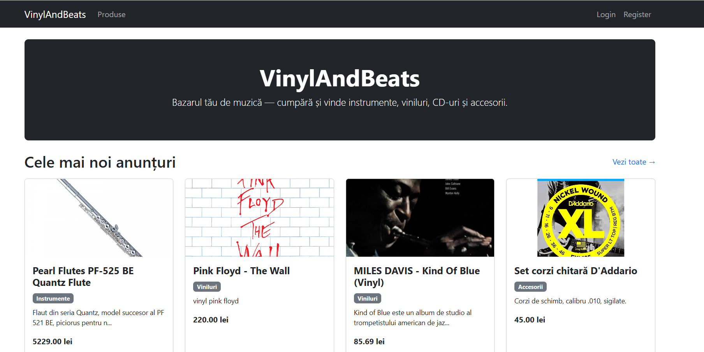

### Products Page

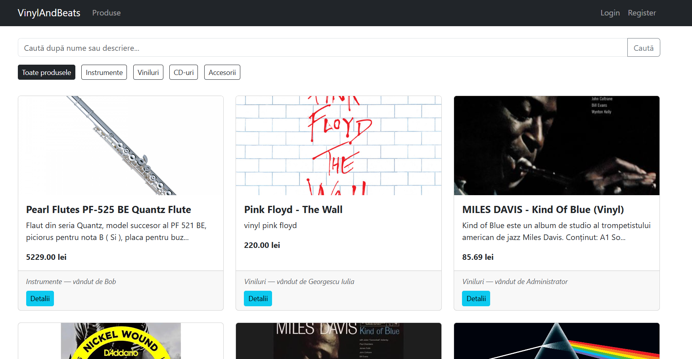

### Product Details

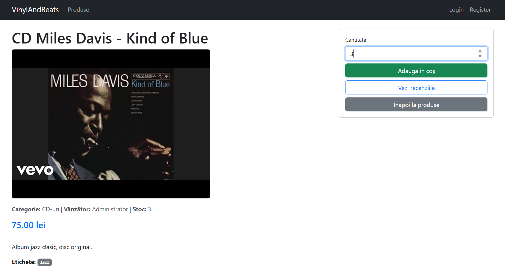

### Authentification

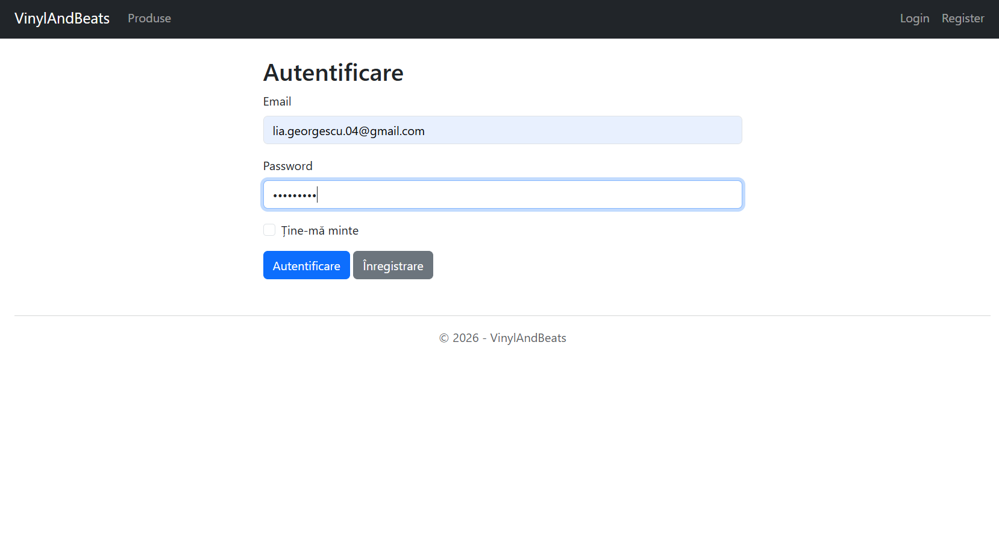

### Register

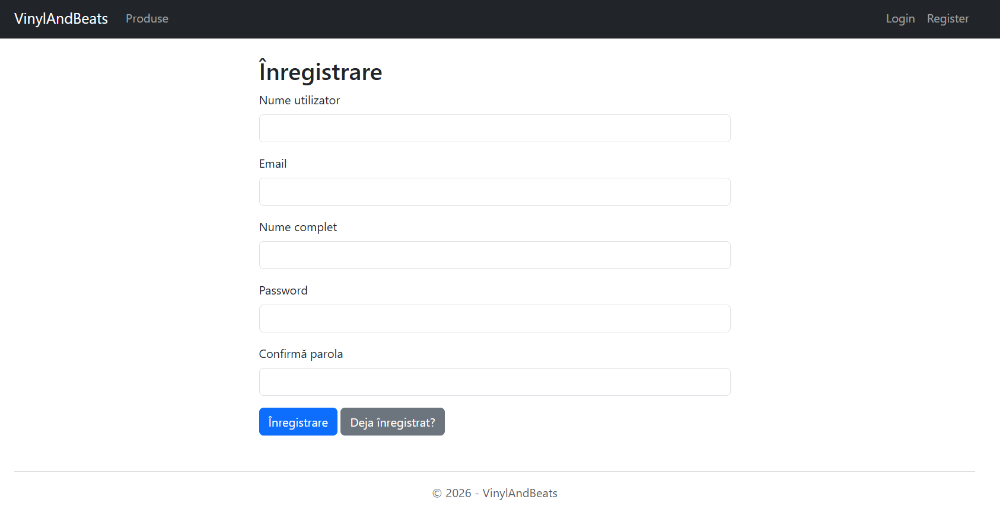

### Create Product

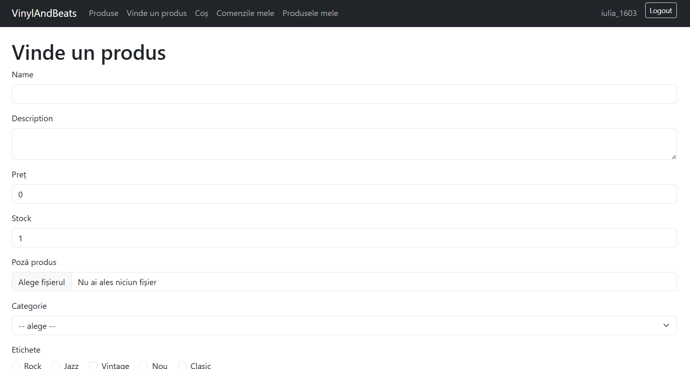

### My Products

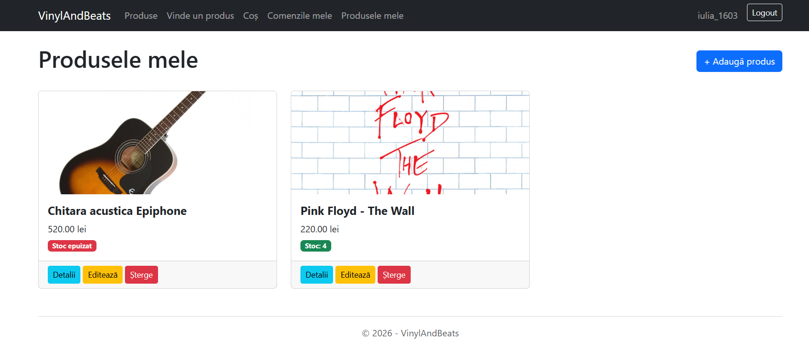

### Cart

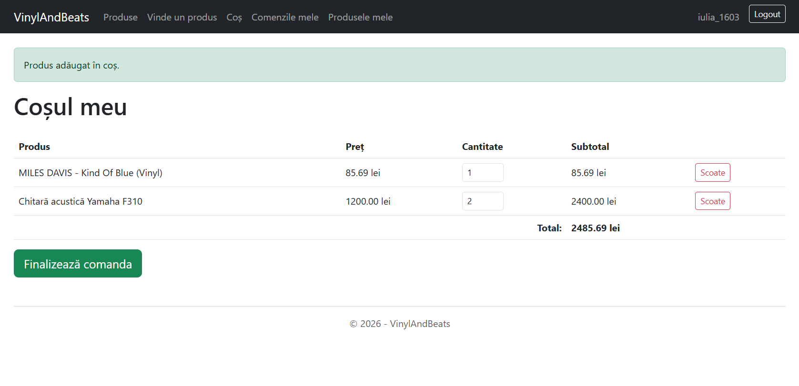

### Orders

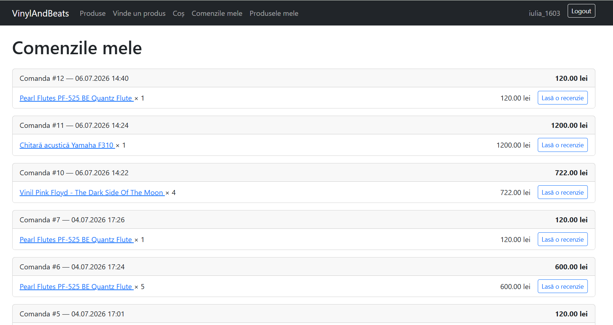

### Create Review

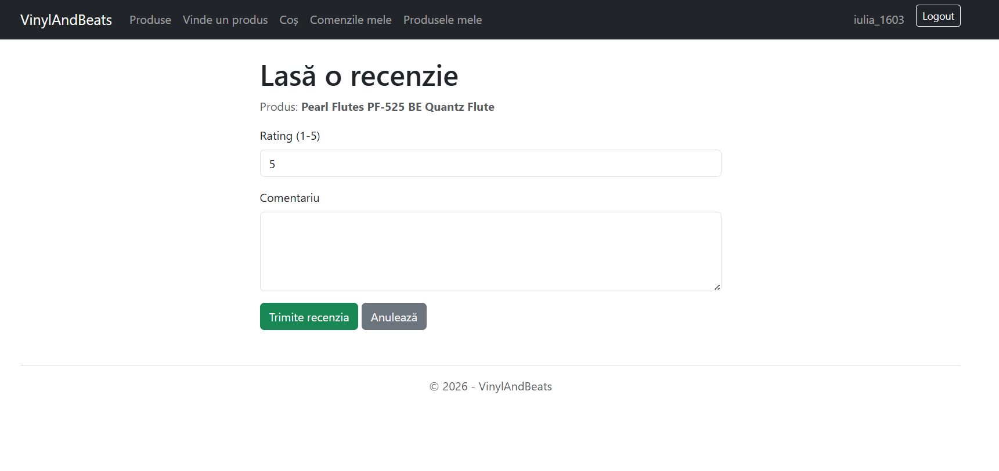

### Angular Reviews Page

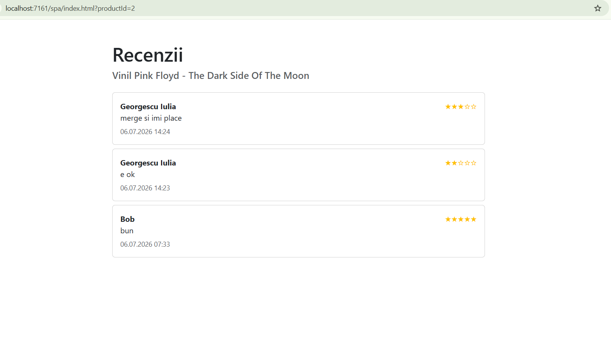

### Swagger UI

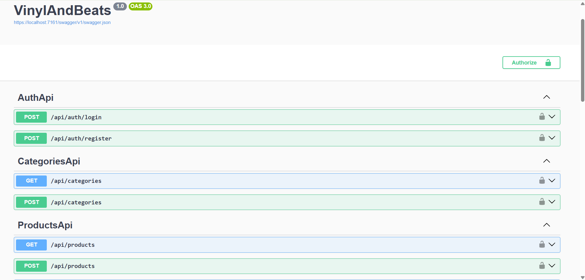
